## Using Github

We recommend using Github Organisations to organise and control read/write access to your repositories for your final project.

You will likely have 2 repositories - a frontend and a backend.

1. One member of the team should create an Organisation for your group
2. Invite the other members of your team by going to the People section and clicking Invite Member
3. Other members should join the organisation
4. Ensure members are given "Owner" access

## Creating your front-end repository

Assuming you are building your frontend application with React, and using Create React App to do so, follow the below instructions to get your repository started:

1. 1 member of the group creates an application with Create React App (we'll cover this dont worry) using the command `npx create-react-app project-name-frontend`
2. `cd project-name-frontend`
3. Git will have been automatically by Create React App. If you do `git log` you will see the initial commit made by Create React App.
4. Go to Github and create a new repository under your organisation. This will be for your frontend code.

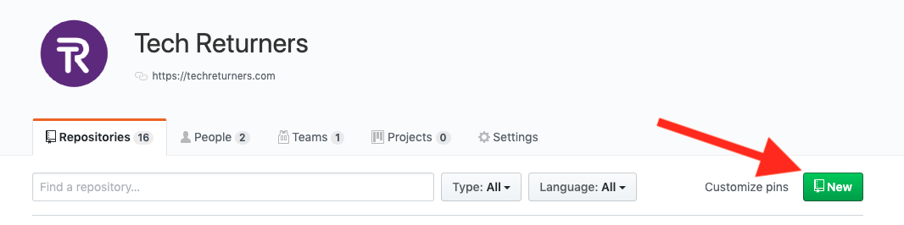

5. Make sure you keep it public (so coaches and employers can see your code!) and do not initialize it with a README:

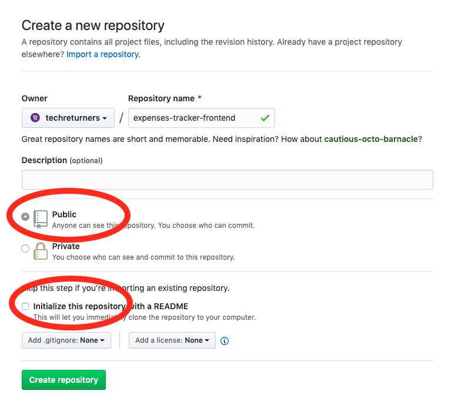

6. Once created, copy the URL ensuring that HTTPS option is selected:

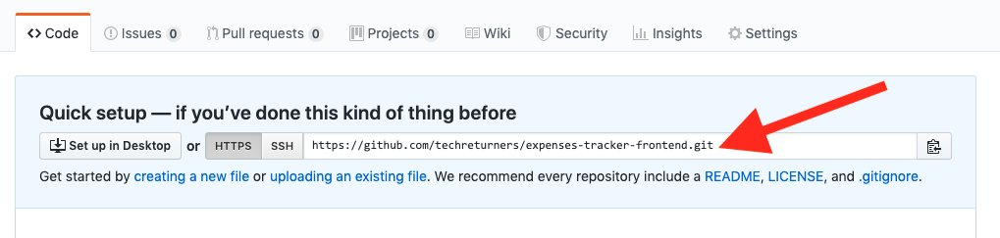

7. Go back to the terminal and we now need to create a link to the new repository. Run `git remote add origin https://github.com/techreturners/expenses-tracker-frontend.git` pasting in the URL for your new repository.
8. Now we can push the initial code up to the **main branch**. This is the only time we'll push to main - just to get the project started. In the future we will work on separate branches (see below). Run `git push origin main`
9. Refresh Github and you should see your code
10. Now follow the below instructions for using separate branches to do your work.
11. Other members of your team can **clone** this repository in order to work on it: `git clone https://github.com/techreturners/expenses-tracker-frontend.git`

## Creating your back-end repository

Creating the back-end repository will be a similar process to the frontend except we are using the [Serverless Framework](https://www.serverless.com/) to create our project template, instead of Create React App. (Again, dont worry if you haven't come across serverless as yet we'll be covering this in the programme)

1. 1 person in the group runs the command to create the project: `serverless create --template aws-nodejs --path my-project-backend` and `cd my-project-backend`
2. Unlike Create React App, Serverless does not initialise Git for us so we must do that ourselves. Run `git init` inside your backend project.
3. Create an initial commit
4. Go to Github and again, create a new repository inside your organisation following the same instructions as above.
5. Go back to the terminal and create a link to the new repository (as before).
6. Again, push the initial commit to the main branch.
7. Refresh Github and you should see your code
8. Now follow the below instructions for using separate branches to do your work.
9. Other members of your team can **clone** this repository in order to work on it: `git clone https://github.com/techreturners/expenses-tracker-backend.git`

## Branching, Pull Requests & Merging

We recommend you think of your work in descrete chunks, or "features".

For example, "App shows all the todos" could be a single feature which you begin working on first of all. Later, another feature could be "Allow a todo to be added to the list". Each feature would involve changes to the frontend code _and_ the backend code.

When making changes to code, use **banches** in Git to separate your work. Do not work on the **main** branch - you should only be merging work into the main branch when you know the code works.

Your workflow, on a single repository, may be as follows:

- You are on the main branch. Check you have no uncommitted/staged changes (you shouldn't, on the main branch, because you shouldn't be working on this branch!) (`git status`)
- Check out a new branch for a new feature (you may want to read up on branch naming conventions) (`git checkout -b my-branch-name`)
- Do your work, adding and committing frequently
- When you are done, run `git push origin my-branch-name` to push the changes to Github. This will push changes to a branch on Github called `my-branch-name` in this case, but we need to merge these changes into the main branch, ideally through a review process.
- Go to the repository on Github and go to the Pull Requests tab, click New Pull Request

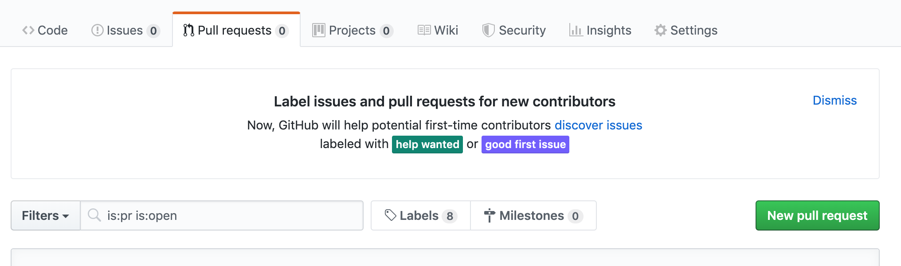

- For the base branch, select **main** and then choose the branch you want to merge into main.

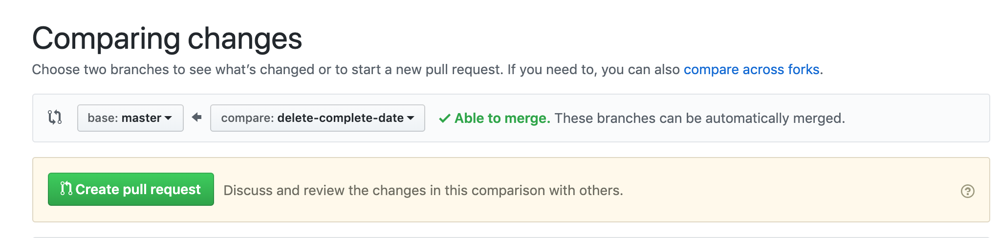

- It is helpful to add a comment about what changes you are making when opening the Pull Request:

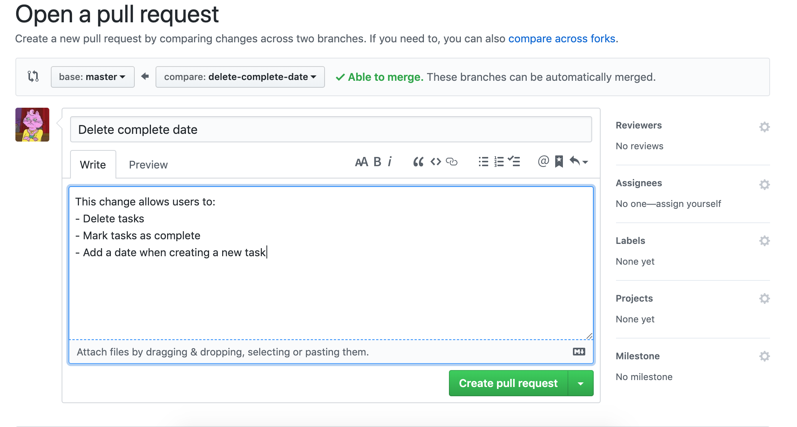

- Ask another member of the team to review your work and let you know whether they are happy for it to be merged. You can ask via Slack or use Github's **review** feature.
- Your colleague may suggest changes, in which case, make those changes locally, make a new commit for them, and push to the branch on Github again (`git push origin my-branch-name`). The Pull Request will automatically update and you can alert your colleague that the changes have been made.
- When you are happy, you (or a colleague) may merge the request.

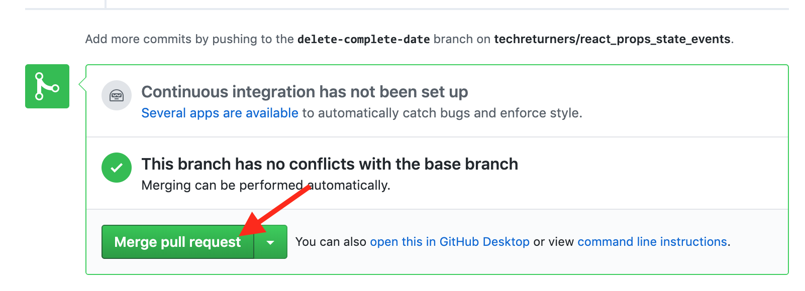

- Once the request is merged, the code from this branch will now be in **main**, so anyone starting a new branch in this repository should remember to **pull** from main before checking out their new branch: `git checkout main` (to get back to main) and `git pull origin main` (to pull in any recently merged changes).
- You can then start again from the beginning of this workflow for the next feature 😀

## Merge Conflicts

When dividing work it may be the case that more than 1 person (or pair) is working on the same repository at the same time. This is fine, and common within teams. We recommend you try to split the work to be done so that two different people aren't likely to be working on the same _file_ but sometimes it is inevitable that 2 people will change the same file.

For example, if two people install two different packages for their 2 different pieces of work, then two different commits from both people will contain changes to the `package.json` file and the `package-lock.json` file.

In these situations Git usually needs some help in figuring out what it should do with these files.

When opening a **pull** request you will see:

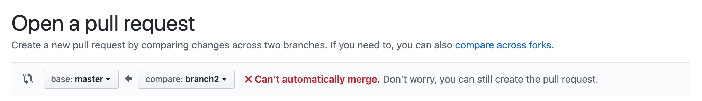

This is fine; open the pull request anyway and then you will need to manually resolve whatever conflicts have arisen:

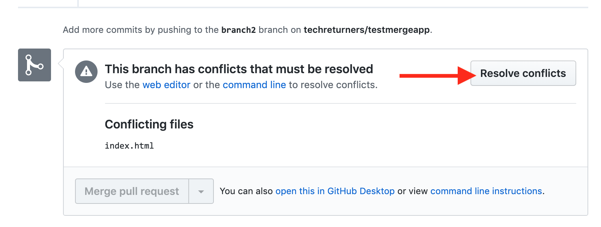

You will be shown an online text editor, where the conflicts between the main branch and the branch you are attempting to merge will be indicated with symbols `<<<<<<<<<<`, `>>>>>>>>>>` and `=============`. It is your job to remove whatever section of code you want to discard, and keep the section of code which you want to keep. Bear in mind there may be multiple files which need sorting out.

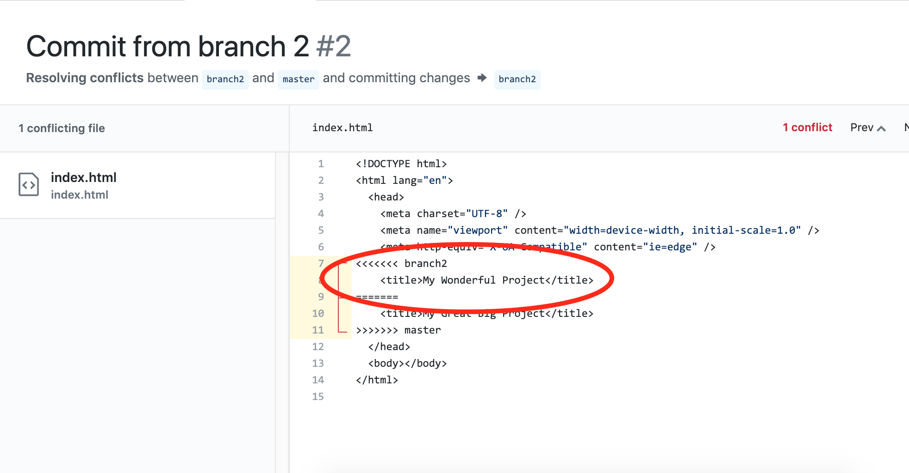

When you have done this, click "Mark as Resolved"

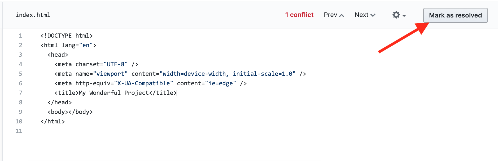

And then "Commit Merge" on the top right.

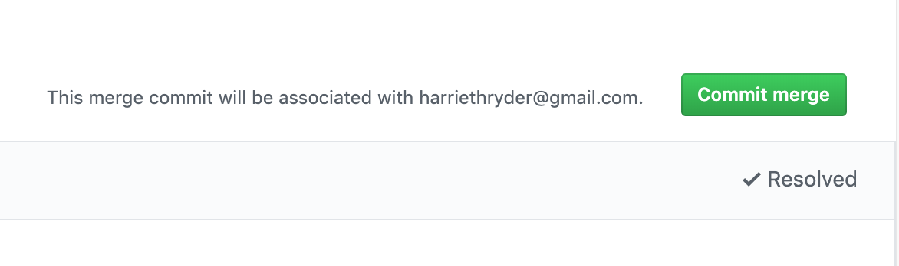

You can now ask for your Pull Request to bew reviewed, following whatever your normal process is.

## Two people working on the same branch?

If two people are pushing to the same branch, you may find that you cannot push your work if someone else has recently updated the branch. You will get an error like this:

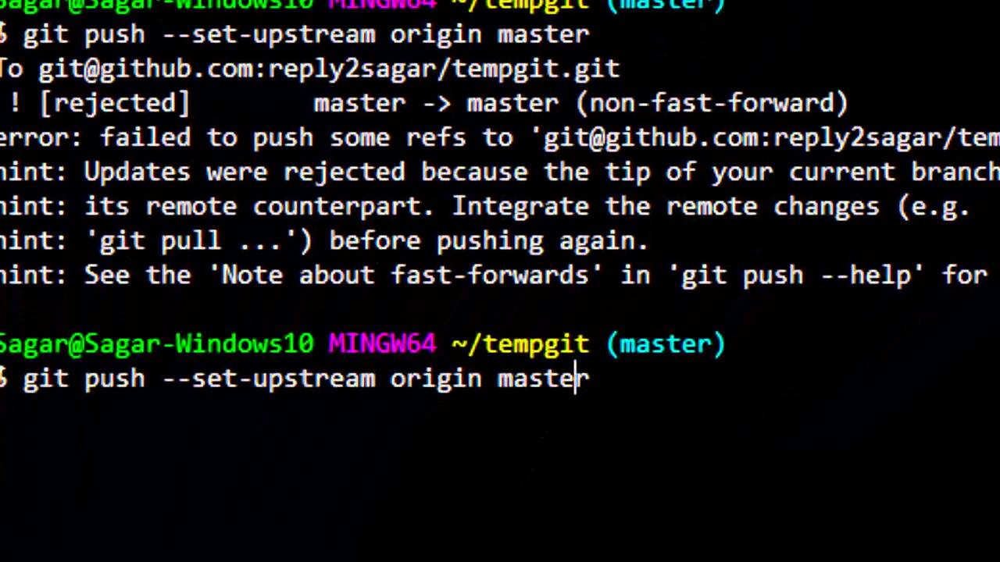

To resolve this, you first need to **pull** the other person's changes:

`$ git pull origin my-branch-name`

Then you can try to push again.

NB You may get a merge conflict when you pull, if both of you have made changes to the same lines in the same file - this will need to be resolved manually in VS Code bt removing the lines you do not want. After resolving the conflict, add and commit the changed files, and then try to push again.

## Project Management Tips

- You might want to use a workflow visualiser/task tracker such as [Trello](https://trello.com/), [GitHub project board](https://docs.github.com/en/free-pro-team@latest/github/managing-your-work-on-github/about-project-boards) or [JIRA](https://www.atlassian.com/software/jira)
- It's a good idea to decide on your workflow with your team so everyone knows the process
- Split work into descrete chunks ahead of time - make sure you all know what's coming up next and what the right order of work should be
- Maybe designate someone as **project manager** to ensure the process is adhered to, and take on the lion's share of organisation?
- You may want to have regular **stand up** meetings (remote or in person) where each team member spends a couple of minutes updating the rest of the team on their progress and explaining what they plan to do next, and whether they have experienced any problems.
- Break all work into the **smallest chunks** possible so you are always merging really small changes into the main branch. It helps with the merge conflicts, trust us 😉
